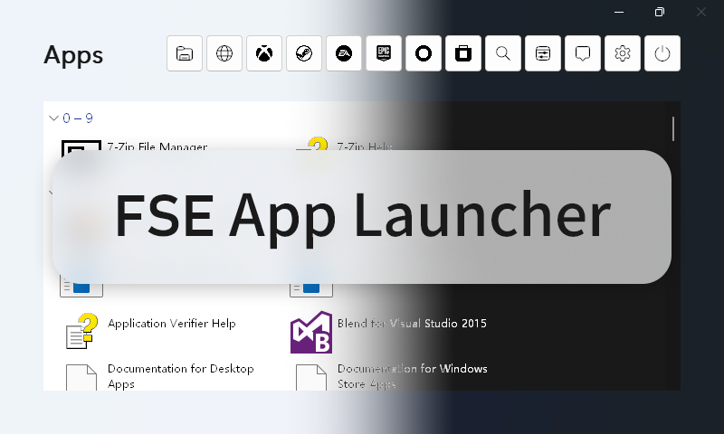
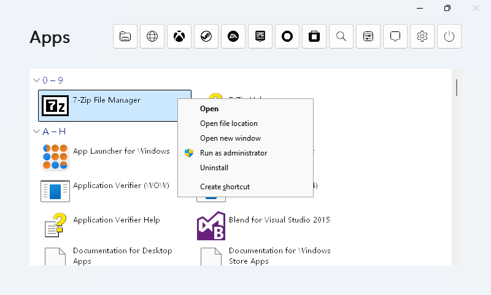
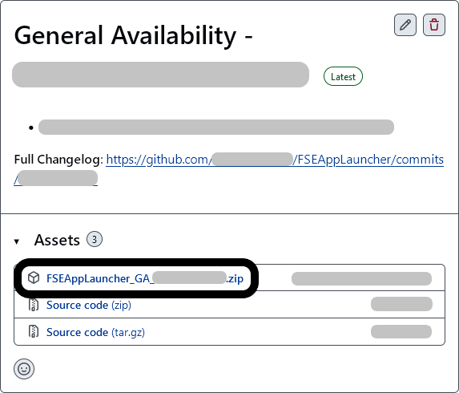
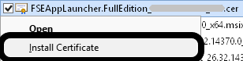
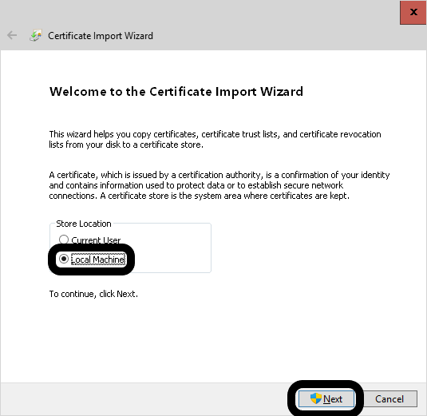
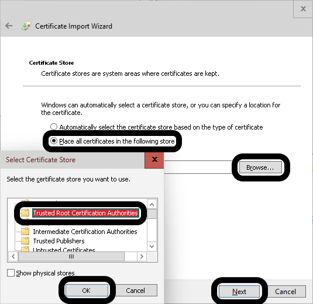
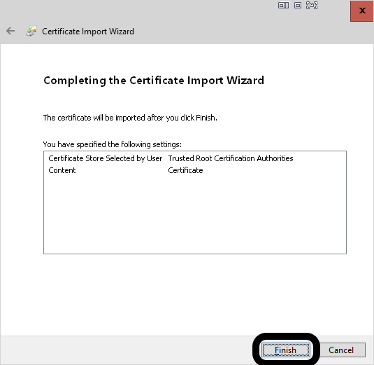
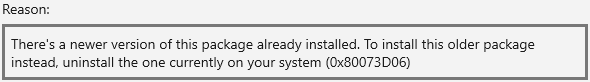
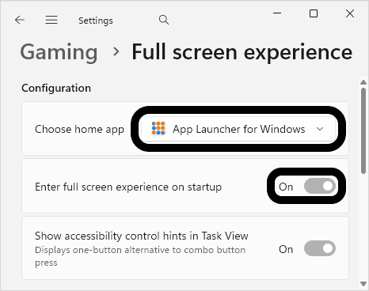

 <picture>
  
 </picture>

<h1 align="center">
 FSE App Launcher for Windows
</h1>

 FSE App Launcher is a lightweight app launcher designed for Xbox full screen experience (FSE) on Windows 11.

## Highlights

- Supports **setting it as home app** on devices compatible with the **FSE**[^1] feature (see "System Requirements").
- Supports launching **any** app (including non-game apps) **under FSE[^1]**, **eliminating the need to switch back and forth between FSE[^1] and desktop**.
- Provides the **native right-click menu** based on Windows Shell, with suppport for "Run as administrator", "Open new window", "Open file location", "Uninstall", etc. It can be used as **a substitute to the all apps list of Start Menu**.
- Provides a set of buttons for quick access to **commonly used features[^2]**.

## System Requirements

#### Minimum requirements

- Windows 11, version 22H2+

#### Other requirements (if you intend to set the application as home app of full screen experience)

- Windows 11, version 25H2+
- The device is a gaming handheld

## Screenshots

 <picture>
  
 </picture>

## Installation and Configuration

#### 1. Download package from Github

- Go to the [Releases](https://github.com/La-La-Chicken/FSEAppLauncher/releases/latest) page, download the archive below the Assets section.

 <picture>
  
 </picture>

- Extract the archive to any directory of your choice.

#### 2. Install the developer certificate

- Right-click (or press and hold on) the security certificate file (*.cer), then select "Install Certificate".

 <picture>
  
 </picture>

- Select "<u>L</u>ocal Machine", then click "<u>N</u>ext".

 <picture>
  
 </picture>

- If the User Account Control dialog appears, click "Yes" to approve the request.
- Select "<u>P</u>lace all certificates in the following store", and click "B<u>r</u>owse...". Select "Trusted Root Certification Authorities", click "OK", then click "<u>N</u>ext".

 <picture>
  
 </picture>

- Click "<u>F</u>inish".

 <picture>
  
 </picture>

#### 3. Install the dependency

- Double click the dependency "Microsoft.VCLibs.x64.14.00.Desktop.appx" and then click "Install".

  ℹ️ If the installation fails and prompts "There's a newer version of this package already installed. To install this older package instead, uninstall the one currently on your system (0x80073D06)", it indicates that the dependency is **already installed**, and **you can directly install the application**.

 <picture>
  
 </picture>

#### 4. Install the application

- After installing the certificate and dependency, you can install the application by double clicking "FSEAppLauncher...x64.msix" and then click "Install".

#### 5. Configure the application as the home app[^3]

- Open System Settings, click "Gaming", then click "Full screen experience".
- Beside "Choose home app", select "App Launcher for Windows", and enable "Enter full screen experience on startup".
- Optionally enable "Show accessibility control hints in Task View" based on your needs.

 <picture>
  
 </picture>

## What's new

#### General Availability - Version 26.23.31455.0

- Fixed the bug that the client area is black on elastic overscroll.

#### Beta - Version 26.30.1200.0 (Mar 2026)

- Added a set of buttons for quick access to commonly used features.
- Now the App Launcher UI no longer covers the taskbar.
- Updated to Per-Monitor v2 DPI awareness mode to adapt to dynamic DPI changes.
- Adapted to dynamic light / dark mode changes.
- Added support for Windows 11, version 22H2/23H2.

## Developing and debugging

Use the toolchain to develop:

- Windows 10, version 1607+
- Microsoft Visual Studio 2017+
	- C++ desktop development
		- MSVC v141
		- Windows 10 SDK (10.0.19041)
		- C++ MFC development tools

**Windows 11, version 22H2+ is required to run or debug the packaged application.**

## Contributing

This project welcomes contributions of all types, including new features, bug fixes, UI / UX redesign, documentation, etc.

## Privacy

The application needs to access your app list to display the "Apps" page. Your user information will not be sent to any organization or individual.

## License

This project is licensed under the Unlicense.

This means unlicensed works, modifications, and larger works may be distributed under different terms and without source code.

[^1]:Also known as "Xbox Handheld Mode".
[^2]:The "Xbox" button requires the latest version of [Xbox app](https://apps.microsoft.com/detail/9MV0B5HZVK9Z). The "Command Palette" button requires the latest version of [PowerToys](https://github.com/microsoft/PowerToys/releases/latest).
[^3]:If your operating system version is lower than Windows 11, version 25H2, or your device is not a gaming handheld, you may not see "Full screen experience", and some options may not appear.