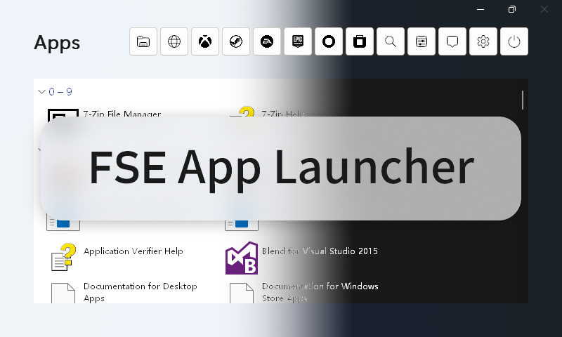
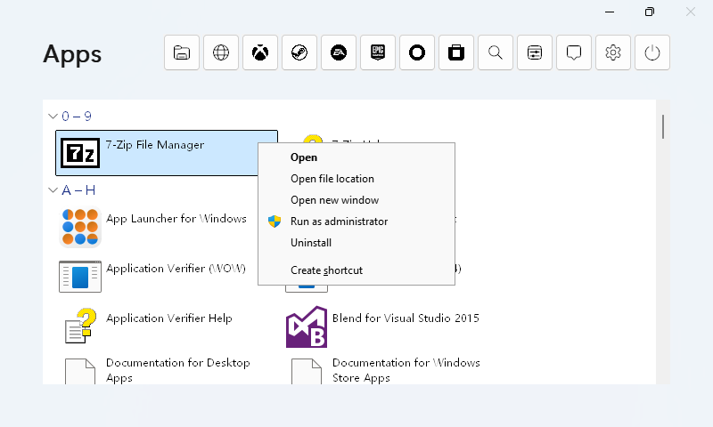
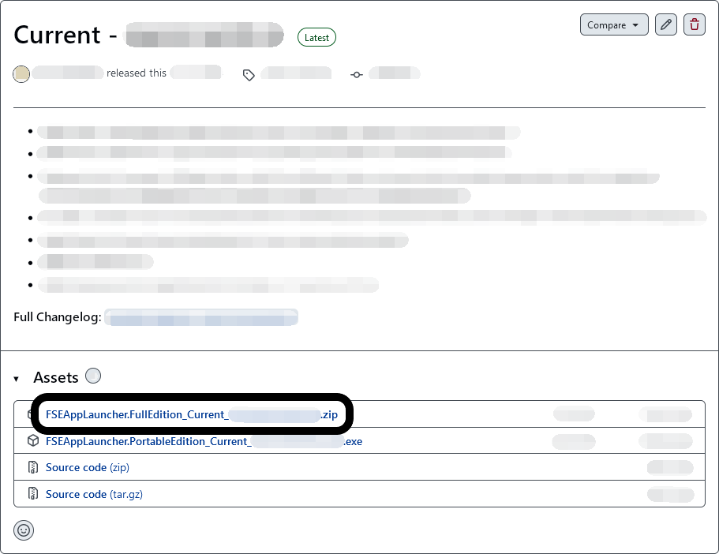
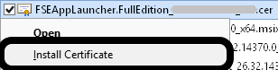
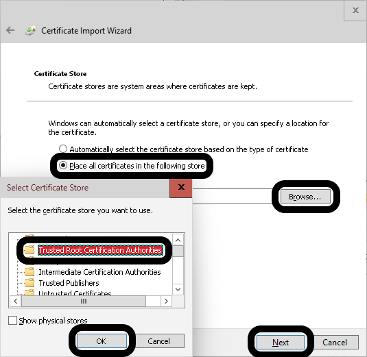
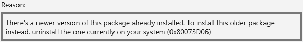
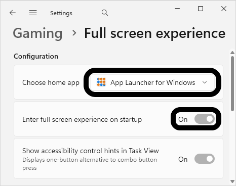
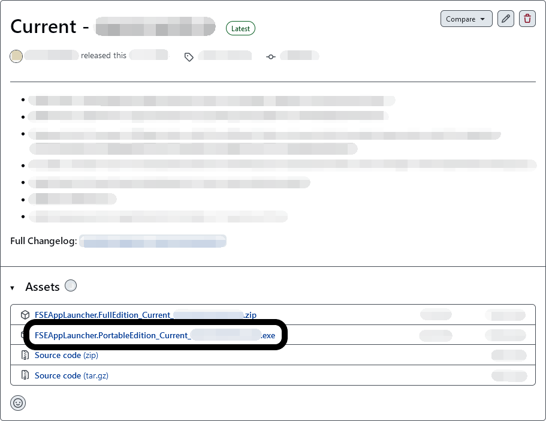

<h1 align="center">
 FSE App Launcher for Windows
</h1>

Resurrect the acclaimed <b>tablet mode</b> in Windows 11—a launchpad designed for the brand new <b>Xbox mode</b>.

## Highlights

- Inspired by **tablet mode** in Windows 10. An ideal match for **Xbox mode**[^1]. **Set it as the home app** to enhance the experience. (see "[System Requirements](#system-requirements)")
- Launch **any installed app**, **not just games**. Eliminate the need to switch back and forth between Xbox mode[^1] and desktop.
- Quick access to **popular gaming platforms**[^2] and **missing desktop features**. Remember the Windows 8 fiasco? You no longer have to switch to desktop just to **shut down** your device.
- **Native context menu** with suppport for "Open file location", "Uninstall", etc. A substitute to the all apps list of Start Menu.
- Native support for touch screen, high DPI, dark mode, and Mica.

## System Requirements

### Minimum requirements

- Windows 11, version 21H2+

### Other requirements

#### If you intend to set it as the home app of Xbox mode[^1]:

- Windows 11, version 25H2+
- The device is a gaming handheld

ℹ️ Only Full Edition supports setting as the home app of Xbox mode[^1].

## Screenshots

## Installation and Configuration

There are two editions of App Launcher: Full Edition and Portable Edition. Only Full Edition supports setting as the home app of Xbox mode[^1].

### Full Edition

#### 1. Enable Developer Mode

- Enable "Developer Mode" on the System › Advanced page in Settings.

#### 2. Download the package

- Go to the [Releases](https://github.com/La-La-Chicken/FSEAppLauncher/releases/latest) page, download the archive of Full Edition below the Assets section.

- Extract the archive to any directory of your choice.

#### 3. Install the developer certificate

- Right-click (or press and hold on) the security certificate file (*.cer), then select "<u>I</u>nstall Certificate".

- Select "<u>L</u>ocal Machine", then click "<u>N</u>ext".

- If the User Account Control dialog appears, click "Yes" to approve the request.
- Select "<u>P</u>lace all certificates in the following store", and click "B<u>r</u>owse...".
- Select "Trusted Root Certification Authorities", click "OK", then click "<u>N</u>ext".

- Click "<u>F</u>inish".

#### 4. Install the dependency

- Open the dependency "Microsoft.VCLibs.x64.14.00.Desktop.appx" and then click "Install".
ℹ️ If the installation fails and prompts "There's a newer version of this package already installed. To install this older package instead, uninstall the one currently on your system (0x80073D06)", it indicates that the dependency **has already been installed**, and **you can directly [install App Launcher](#5-install-app-launcher)**.

#### 5. Install App Launcher

- Open the MSIX package (FSEAppLauncher.FullEdition ... .msix) and then click "Install".

#### 6. Configure App Launcher as the home app of Xbox mode[^1]

- Open System Settings, click "Gaming", then click "Full screen experience"[^3].
- Beside "Choose home app", select "App Launcher for Windows", and enable "Enter full screen experience on startup".
ℹ️ It is also recommended to enable "Show accessibility control hints in Task View" to enhance the experience of game controllers.

- At your next sign-in, your device will automatically enter Xbox mode[^1] with App Launcher as the home app.

### Portable Edition

ℹ️ Portable Edition does not support setting as the home app of Xbox mode[^1].

- Go to the [Releases](https://github.com/La-La-Chicken/FSEAppLauncher/releases/latest) page, download Portable Edition (FSEAppLauncher.PortableEdition ... .exe) below the Assets section.

- Directly run the application without installation and configuration.

## What's new

#### Current - Version 26.32.14370.0

- Added the unpackaged Portable Edition (without Xbox mode[^1] home app support).
- Added more buttons for quick access to popular game platforms and desktop features.
- Replaced the Command Palette button with the Search button to provide a consistent experience with desktop. On eligible devices, it launches Copilot or a user-specified AI app.
- The App Launcher UI is no longer forced to be maximized, no longer topmost, and no longer minimized when losing focus. Added touch-friendly resizing borders for non-maximized windows.
- Added an About box.
- Added backward compatibility for Windows 11, version 21H2.

## Developing and debugging

Use the toolchain to develop this project:

- Windows 10, version 1607+
- Microsoft Visual Studio 2017+
	- C++ desktop development
		- MSVC v141
		- Windows 10 SDK (10.0.19041)
		- C++ MFC development tools

Windows 11, version 21H2+ is required to debug or run the application.

## Contributing

This project welcomes contributions of all types, including new features, bug fixes, UI / UX redesign, documentation, etc.

## Privacy

The application needs to access your app list to display the "Apps" page. Your user information will not be sent to any organization or individual.

## License

This project is licensed under the Unlicense.

This means unlicensed works, modifications, and larger works may be distributed under different terms and without source code.

[Notices and Information](NOTICE.md)

[^1]:Formerly "full screen experience". Also referred to as "Handheld Mode".
[^2]:The "Xbox" feature requires the latest version of [Game Bar](https://apps.microsoft.com/detail/9NZKPSTSNW4P), [Xbox app](https://apps.microsoft.com/detail/9MV0B5HZVK9Z) and [Gaming Services](https://apps.microsoft.com/detail/9MWPM2CQNLHN). The "Steam Big Picture Mode" feature requires the latest version of [Steam](https://store.steampowered.com/about/). The "EA" feature requires the latest version of [EA app](https://www.ea.com/ea-app#downloads). The "Epic Games Launcher" feature requires the latest version of [Epic Games Store](https://apps.microsoft.com/detail/XP99VR1BPSBQJ2). The "GOG Galaxy" feature requires the latest version of [GOG Galaxy](https://apps.microsoft.com/detail/XPFFXW40W60KCF). The "Microsoft Store" feature requires the latest version of [Microsoft Store](https://apps.microsoft.com/detail/9WZDNCRFJBMP).
[^3]:The name of the "Full screen experience" entry may change in a future update due to the official renaming.