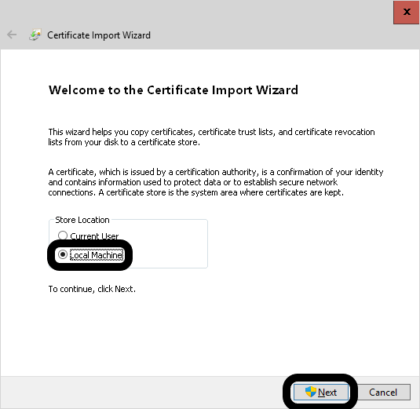
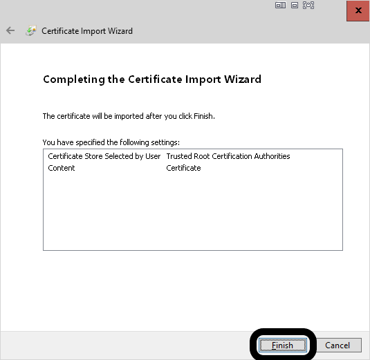
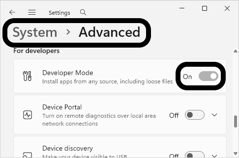

 <picture>
  
 </picture>

<h1 align="center">
 FSE App Launcher for Windows
</h1>

 A launchpad designed for Xbox full screen experience (FSE) in Windows 11. Resurrect the acclaimed tablet mode.

## Highlights

- Supports **setting it as home app** on devices compatible with the **FSE[^1]** feature (see "[System Requirements](#System Requirements)").
- Launch **any** app (including non-game apps) **under FSE[^1]**, eliminating the need to switch back and forth between FSE[^1] and desktop. **Brings the experience closer to tablet mode in Windows 10**.
- Quick access to **popular gaming platforms and missing desktop features[^2]**.
- **Native context menu** with suppport for "Run as administrator", "Open new window", "Open file location", "Uninstall", etc. A substitute to the all apps list of Start Menu.
- Fix a major design flaw dating back to Windows 8 - **it has a power button!** But the Xbox app does not have that ;D
- Native support for touch screen, high DPI, dark mode, and Mica.

## System Requirements

#### Minimum requirements

- Windows 11, version 21H2+

#### Other requirements (if you intend to set it as home app of FSE[^1])

- Windows 11, version 25H2+
- The device is a gaming handheld

Portable Edition does not support setting as home app of FSE[^1].

## Screenshots

 <picture>
  
 </picture>

## Installation and Configuration

### Full Edition

#### 1. Download package from Github

- Go to the [Releases](https://github.com/La-La-Chicken/FSEAppLauncher/releases/latest) page, download the archive of Full Edition below the Assets section.

 <picture>
  
 </picture>

- Extract the archive to any directory of your choice.

#### 2. Install the developer certificate

- Right-click (or press and hold on) the security certificate file (*.cer), then select "Install Certificate".

 <picture>
  
 </picture>

- Select "<u>L</u>ocal Machine", then click "<u>N</u>ext".

 <picture>
  
 </picture>

- If the User Account Control dialog appears, click "Yes" to approve the request.
- Select "<u>P</u>lace all certificates in the following store", and click "B<u>r</u>owse...". Select "Trusted Root Certification Authorities", click "OK", then click "<u>N</u>ext".

 <picture>
  
 </picture>

- Click "<u>F</u>inish".

 <picture>
  
 </picture>

#### 3. Install the dependency

- Open the dependency "Microsoft.VCLibs.x64.14.00.Desktop.appx" and then click "Install".

  ℹ️ If the installation fails and prompts "There's a newer version of this package already installed. To install this older package instead, uninstall the one currently on your system (0x80073D06)", it indicates that the dependency is **already installed**, and **you can directly install the application**.

 <picture>
  
 </picture>

#### 4. Enable Developer Mode

- Enable Developer Mode in System Settings on the System → Advanced page.

 <picture>
  
 </picture>

#### 5. Install the application
- Install the application by opening the MSIX package (FSEAppLauncher.FullEdition ... .msix) and then click "Install".

#### 6. Configure the application as the home app[^3]

- Open System Settings, click "Gaming", then click "Full screen experience".
- Beside "Choose home app", select "App Launcher for Windows", and enable "Enter full screen experience on startup".
- Optionally enable "Show accessibility control hints in Task View" based on your needs.

 <picture>
  
 </picture>

### Portable Edition

- Go to the [Releases](https://github.com/La-La-Chicken/FSEAppLauncher/releases/latest) page, download Portable Edition (FSEAppLauncher.PortableEdition ... .exe) below the Assets section.
- You can directly run the application without installation and configuration.

Portable Edition does not support setting as home app of FSE[^1].

 <picture>
  
 </picture>

## What's new

#### Current - Version 26.32.14370.0

- Added the unpackaged Portable Edition (does not support setting as home app of FSE).
- Added more buttons for quick access to popular game platforms and desktop features.
- Replaced the Command Palette button with the Search button to provide a consistent experience with the desktop environment. On eligible devices, it launches Copilot or a user-specified AI app.
- The App Launcher UI is no longer forced to be maximized, no longer topmost, and no longer minimized when losing focus.
- Added touch-friendly resizing borders for non-maximized windows.
- Added an About box.
- Added backward compatibility for Windows 11, version 21H2.

## Developing and debugging

Use the toolchain to develop this project:

- Windows 10, version 1607+
- Microsoft Visual Studio 2017+
	- C++ desktop development
		- MSVC v141
		- Windows 10 SDK (10.0.19041)
		- C++ MFC development tools

Windows 11, version 21H2+ is required to run or debug the application.

## Contributing

This project welcomes contributions of all types, including new features, bug fixes, UI / UX redesign, documentation, etc.

## Privacy

The application needs to access your app list to display the "Apps" page. Your user information will not be sent to any organization or individual.

## License

This project is licensed under the Unlicense.

This means unlicensed works, modifications, and larger works may be distributed under different terms and without source code.

[Notices and Information](NOTICE.md)

[^1]:Also known as "Xbox Handheld Mode".
[^2]:The "Xbox" feature requires the latest version of [Game Bar](https://apps.microsoft.com/detail/9NZKPSTSNW4P), [Xbox app](https://apps.microsoft.com/detail/9MV0B5HZVK9Z) and [Gaming Services](https://apps.microsoft.com/detail/9MWPM2CQNLHN). The "Steam Big Picture Mode" feature requires the latest version of [Steam](https://store.steampowered.com/about/). The "EA" feature requires the latest version of [EA app](https://www.ea.com/ea-app#downloads). The "Epic Games Launcher" feature requires the latest version of [Epic Games Launcher](https://apps.microsoft.com/detail/XP99VR1BPSBQJ2). The "GOG Galaxy" feature requires the latest version of [GOG Galaxy](https://apps.microsoft.com/detail/XPFFXW40W60KCF). The "Microsoft Store" feature requires the latest version of [Microsoft Store](https://apps.microsoft.com/detail/9WZDNCRFJBMP).
[^3]:If your operating system version is lower than Windows 11, version 25H2, or your device is not a gaming handheld, you may not see "Full screen experience", and some options may not appear.